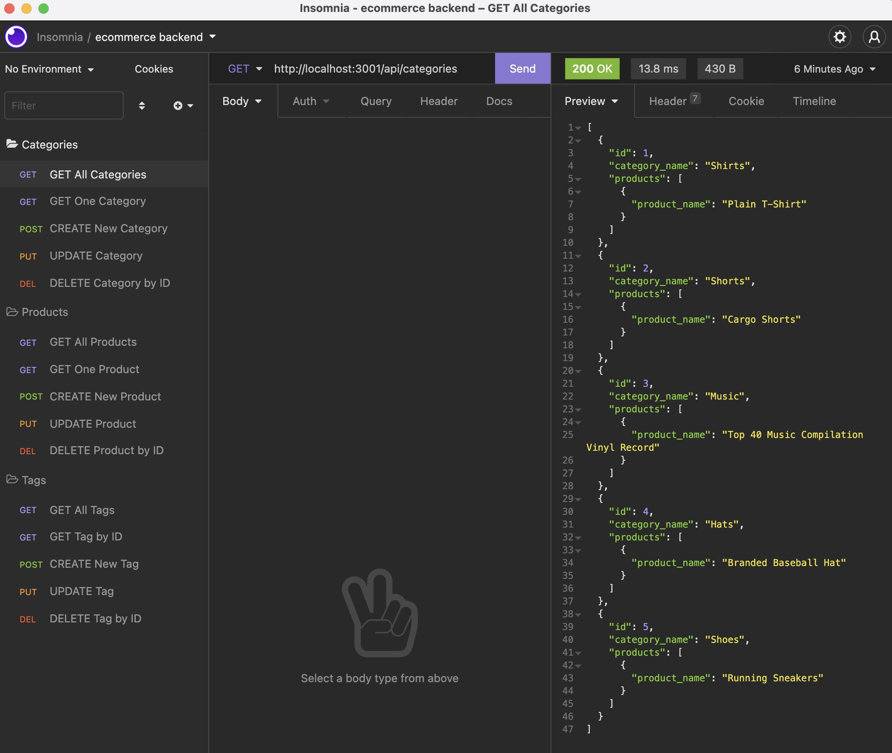

  E-Commerce Back End 

## Description

In this homework assignment I created the backend part for the Ecommerce website with the given seed data. I used SQL and Sequelize along with ExpressJS to link data from the different tables together with foreign keys. I added complete CRUD routes for the various products/categories/tags.

## Table of Contents

- [Installation](#installation)
- [Usage](#usage)
- [Repository-Link](#repository-link)
- [Media](#media)
- [Questions](#questions)
- [License](#license)

## Installation

Run "npm i" in your terminal to install dependencies and then run "npm start".

## Usage

Open whatever API client you use to use routes listed within the routes folder to GET, POST, PUT, and DELETE

## Repository-Link

[Github Repo Link](https://github.com/mattgrogandev/E-CommerceBackEnd)

## Media

[Walkthrough Video Link](https://watch.screencastify.com/v/kfTqQfkmNC5epOSQErxx)

## Questions

If you have any questions regarding this project please contact either on GitHub or by Email below.

GitHub: [mattgrogandev](https://github.com/mattgrogandev)

Email: mattgrogan.dev@gmail.com

## License

Licensed under the MIT license.

[Link to opensource.org license info](https://opensource.org/licenses/MIT)
